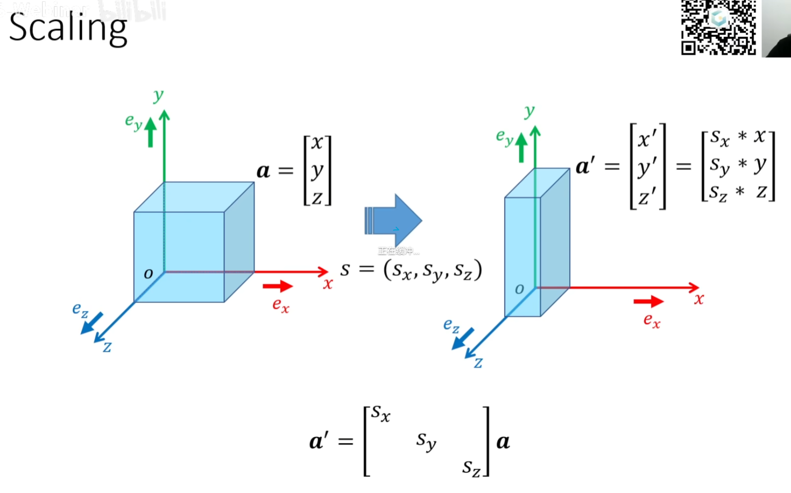
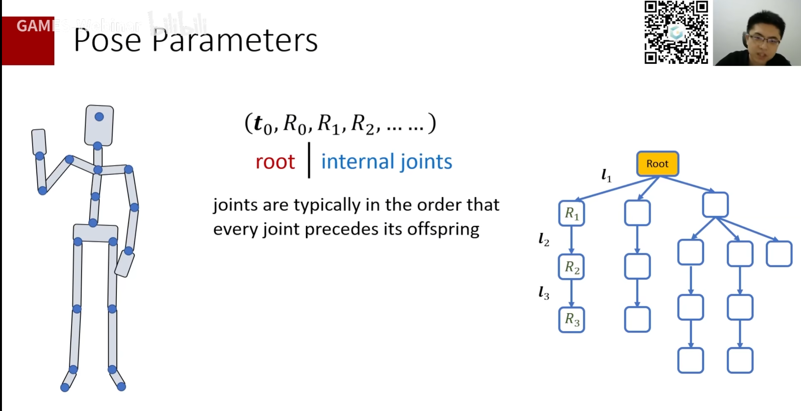
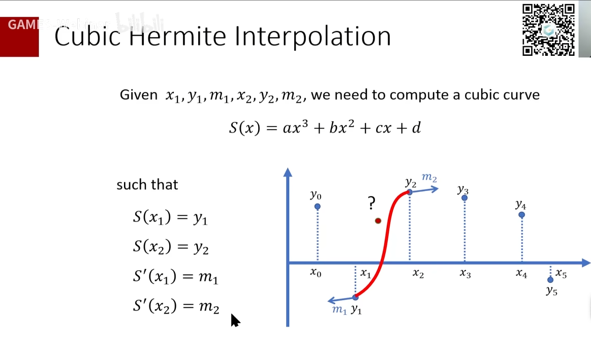
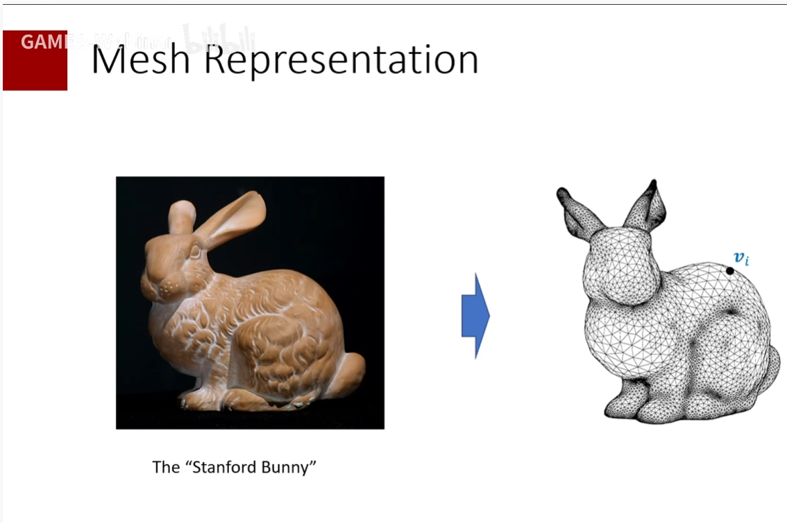
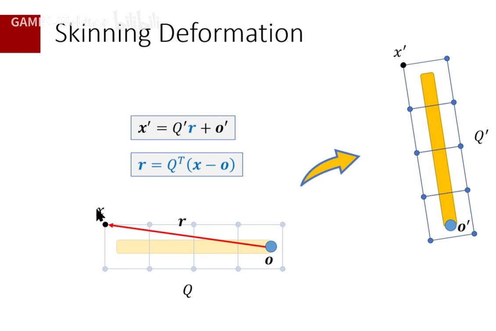

最好还是下载下来在本地看，没目录不方便看。

# 线代

### 点乘

- 

### 叉乘公式

- 
- 
- 不满足结合律，叉乘顺序是不能变的
- 
- 叉乘是0说明，俩向量平行

### 寻找两个向量之间最小旋转

- 如下图，叉乘算法向量做轴，点乘算旋转角度
- 

### 罗德里格旋转公式

- u是旋转轴，theta是旋转角
- 
- 旋转矩阵形式
  - 

### 各种矩阵(包含反对称阵)

- 

### 叉乘矩阵

- 

### 矩阵操作

- 

### 正交矩阵

- 正交矩阵的转置 乘以 本身 = 单位阵
- 正交矩阵的转置  = 正交矩阵的逆
- 

### 行列式

- 
- 性质
  - 
  - 正交矩阵的行列式，在**右手定则**下是1，在**左手定则**下是-1

### 特征向量与特征值

- 

# 变换Transform

### 缩放（以及缩放矩阵）

- 

### 旋转

- 旋转矩阵是正交阵
- 
- 
- 沿着三个分量旋转可以换成-》沿着一个轴u旋转，这个轴u就是旋转矩阵的特征值为1的特征向量，即沿着旋转矩阵特征值为1的特征向量旋转一定的角度可以是想相同效果。
  - 
  - 旋转轴u的计算：
  - 
  - 

### 坐标变换

- 首先明确，世界坐标 = 坐标系的正交基矩阵 乘上 点在这个坐标系的局部向量
- 所以，任何局部坐标系之间，都可以通过先转换为世界坐标，再转换到另一个坐标。
  - 

- 
- 
- 下图中：其实，全局到局部 = 从变换之后的坐标变为变换之前的；从局部到全局 = 给局部的这个坐标施加整体局部坐标系的变换
- 

# 旋转的表示方式

- 欧拉角、四元数、轴角等

### 旋转矩阵表示

- 很难构造、好应用、不好插值
- 

### 欧拉角表示

- 
- 好构造、好应用、好插值(但是需要处理奇异点，即到达临界之后瞬间反向)、但是有万向锁
- 

### 轴角表示

- 好构造、难施加（需要转换成旋转矩阵或者罗德里个公式）、好插值（同样需要处理奇异点）、没有万向锁
- 
- 

### 四元数

- 好构造、好施加、好插值、没有万向锁
- 四元数的定义
  - 
- 四元数的性质
  - 不满足交换律，满足结合律
  - 
  - 
  - 
- 四元数的使用
  - 前后夹，前正后共轭，相当于沿着轴正方向正旋转theta/2，再沿着轴负方向负旋转theta/2。
  - 
- 四元数的插值
  - 普通线性插值，但是不是恒定速度
  - Slerp插值

# 角色动画

## 一个姿势的表示

- root的旋转和位置 和 内部各个关节的旋转
- 

## FK

- 

## IK解法

### Two-joint IK(简单解法)

- 解法：
  - 先旋转关节1，把长度对齐
  - 再旋转关节0，到把末端对齐
  - 旋转轴= l0x和l02的叉乘，旋转角度l0x和l02的点乘
- 

### 循环坐标下降-CCD IK(Cyclic Coordinate Descent IK)

- 做法：依次调整每个旋转角theta（即循环依次旋转每个关节），每次都转动 该关节->末端点向量 到 搞关节->目标点向量上。
  - 
- 优缺点：
  - 优点：计算量小，算得快
  - 缺点：
    - 第一个转动的关节转动角度比较大；
    - 可能会迭代很多次；
    - 结果对初始姿势敏感。即，当目标点移动时，结算结果可能会抖动，不一定会结算出稳定的结果
  - 

### FABRIK

- 与CCD类似，但是CCD是旋转关节，而FABRIK是移动关节。
- 具体流程：
- 
- 具体做法：
  - 

### 梯度下降法(Gradient Descent)

- 根据雅可比矩阵直到，当前的上升最速方向，那么下降就是取梯度的反方向，那么每次都去最速下降方向。
  - 雅可比矩阵：每个参数的梯度组成的矩阵，如下
  - 
  - 步长：即学习率，这个在ML机器学习里讲过，其实是可以动态调整学习率的。
  - 
- 梯度下降公式，注意下面红框，整个红框里的其实是F(theta-i)。
  - 
- 需要注意的是，不同的根节点的选择，造成的IK效果也不一样。
  - 例如，

### Full-body IK

- 首先最直观的，当然是相加所有链条的函数，然后用雅可比矩阵进行梯度下降
  - 
- 但是，还可以有另外一种启发式方法：分为以下几种情况，但是Root都是Pelvis
- 当移动手，但是想要保持脚的相对位置时
  - 从脚解算到手，但是，从root到手施加结算出来的变换，从root到脚施加结算出来的变换的逆变换。
  - 这么做的原因是，从脚解算到手时，从脚到root的解算出来的旋转，实际上是父节点相对于子节点的旋转，而从root开始到脚施加旋转时，是从父节点施加到子节点，此时是需要子节点相对于父节点旋转，所以需要施加结算出来的旋转的逆旋转，以此来保证脚位置不变。
  - 
- 当移动root，但是想保持脚不变
  - 是类似的，从脚解算到root，但是施加逆旋转
  - 
- 当有整个骨骼体有多条IK链时，挨条解算，每解算一条时，需要保持之前的位置不变，所以也就是运用上面的知识。
  - 
- 

## Retargeting Between two reference poses

- 主要是因为两个骨骼初始姿势不一样，但是为了让他们能够使用同一个动画资产，播放相同的效果，所以需要做此操作。
- 以T-pose 到 A-pose为例：
- 单骨骼时，其实就是把该A的初始姿势先变化为T的初始姿势，然后再乘上T的骨骼动画旋转。
  - 
- 当是骨骼链时，骨骼受其父骨骼影响，需要额外左乘上T到A的旋转(也就是图中的A到B)
  - 
- 所以，对于全身情况时，每个骨骼都乘以父骨骼的T到A的转换
  - 

## 关键帧动画

### 帧间插值

- 
- 首先肯定有，**阶梯插值**、**线性插值**，如下图
  - 阶梯插值
  - 线性插值
- 其次，有**多项式插值**，但是多项式插值在次数很高的时候，会剧烈震荡，导致插值不准，所以我们偏好低阶(低次)插值。
  - 
- 为了解决以上问题，我们使用**Cubic Splines(三次样条线插值)**，即每次取四个点的数据，使用三阶多项式。但是这种差值方式每个数据点都会影响整条曲线的绘制，不能局部调整。
  - 
- 所以为了解决以上问题，又有了**Cubic Hermite Spline插值**，用此插值时，只需要局部两个端点的值和这两个端点的导数->一共四组数据（每两个端点之间算作一个三次多项式，一共有N个三次多项式，也就一共需要4N组数据），以此来解决不能局部调整的问题。
  - 

## 动画的使用

### 动作重定向

- 为什么使用动作重定向
  - 
- 动画重定向方法之一：一个基本管线
  - 
- 动画重定向另一个有效方法：IK Rig
  - 只记录关键关节的位置，然后再在目标骨骼上根据关节位置做IK
  - 

## 动画Blend(动画转移)

- Blend：是**不同动作**的动画帧之间转移做插值，使不同动作的切换平滑、不突变。
  - 注意这是不同于帧内插值的，帧内的插值是同一个动画序列之内的动画帧之间的插值，是为了匹配游戏的刷新帧数。
- 用LERP进行插值
- 
- 计算混合的权重：很符合直觉，就是根据选取动画的因素当做自变量，进行插值
- 
- 其一：对于Root Motion动画驱动移动的方式来说，除了需要Blend角色本地的旋转，还需要对齐整个角色的朝向，从而不让角色突然大幅度转向。
  - 
- 其二：而对于只是原地播放动画的方式来说，只要Blend本地旋转就好了。
  - 对于这种方法，如果想要角色整体旋转，只需要手动指定在哪里角色有什么朝向就好了。
  - 

### 动画同步

- 一般的时候，让动画师做的各种循环动画，尽量匹配脚落下的时机。例如跑和走的动画，把他们归一化到1秒之后，我们希望跑和走的左右脚落下的时间，都在这1s内相同。通过这样来使Blend平滑
- 
- 除此之外，我们可以给每个动画左右脚落下的时机贴同步标签，这样让他们混合时，能够根据标签来做混合，使混合平滑。
- 主要是为了在Blend的时候，选定合适的契机进行插值，而不是随便插值，使插值两端不至于差的太多而导致角色过渡不平滑。
- 

### 混合空间

- 只需要几个动画，可以使用混合空间自动插值并播放权重混合动画(只使用临近三个点来计算)
- 

### Skeleton Masked blending

- 使用Mask混合两个动画，使角色不同部位能播放不同动画(例如下肢奔跑时上肢换弹)
  - Mask是一个遮罩，通过设置每根骨头被影响的权重，来控制角色哪些骨头播放这个动画。
- 

### Additive Blending

- 只保存动画的变化量，即只保存相对位移量
- 这也就是为什么Additive动画设置时要设置Base

## 动画状态机

### Cross Fade(平滑切换)

- 状态节点之间的平滑切换
- 
- 各种混合曲线
- 

## 动画Clip

- 

## Root 骨骼

- 为了表示角色的变换信息：例如角色的移动，旋转等
- FBX里的Root信息是作为动画曲线形式，给引擎用的
- UE5里的Enable Root Motion，就是让引擎提取root信息然后保存

# 蒙皮

### 基本概念

- 围绕骨骼缠绕网格点，然后再进行渲染
- 
- 

### 基本计算 蒙皮点跟随骨骼变换

- 就是每个蒙皮点都随着被绑定到的骨骼的变换而变换
- 
- 至于每个蒙皮点的初始相对位置，以及受哪些骨骼影响，则需要根据Bind Pose（Reference Pose）的信息来获取
- 

### 蒙皮点受多骨骼影响

- LBS：每根骨骼的影响的加权平均值
- 
- 以一个蒙皮点受两个骨骼影响为例：每根骨骼的影响的加权平均值
- 

### 面部动画

- 初始姿势➕Delta变形权重(偏移)
- 

# 蒙皮动画的实现

- 整个动画的制作流程：创建网格、创建骨骼体、刷权重、驱动骨骼、驱动蒙皮点
- 
